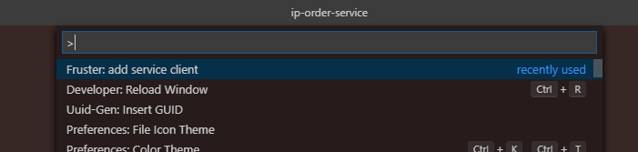
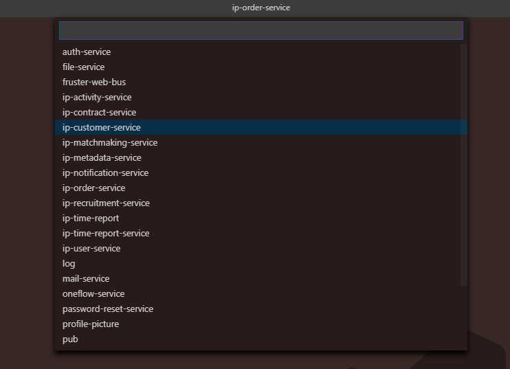
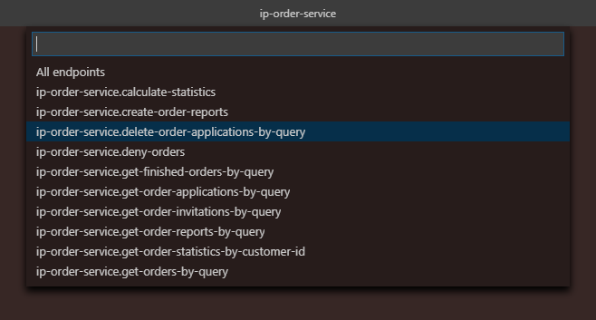

# Fruster vscode tools

Available commands:

- `extension.fruster.add-service-client` > adds a service client by showing a menu of available services and then a menu of available endpoints after selecting service. Supports adding new endpoints to an old service client as needed (Only if generated by fruster-api-doc).

	How to use :

	- make sure the latest version of `fruster-api-doc` is running for your project
	- make sure you are using a repo with a project prefix in the package.json's name key, e.g.

			"name": "ip-order-service"
		The prefix (`ip` in the case above) will be grabbed by the extension and used to access service information.

	- by pressing `ctrl/cmd + shift + p` and selecting `Fruster: add service client` or by binding `extension.fruster.add-service-client` to a key and pressing that key you can bring up the `add service client` menu.
	

	- The first menu will show all available services for the current project

		

	- Selecting one of the services will display all service endpoints in that service. Press enter to select one or many endpoint(s) to include in the service client. Pressing escape closes the menu and creates the service client with all endpoints selected in the previously step. If a service client for the selected service already exists, the endpoints included in that one will not be shown in this menu. To make sure you have the latest version of any existing endpoints you can select `Redownload existing endpoints` to replace the existing endpoints with a newly generated version. Adding any new endpoints when there are existing ones already will combine them.

		
